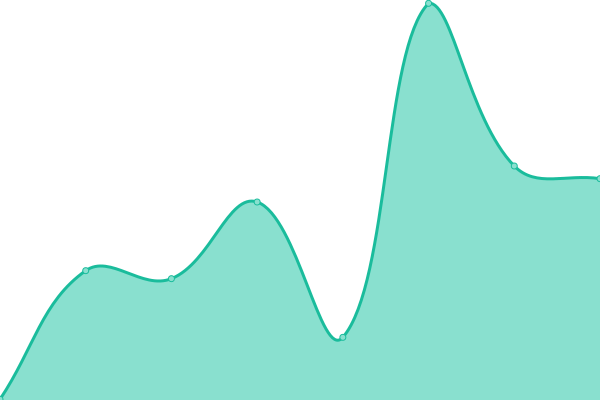
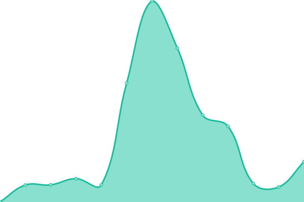

# [📈 Live Status](https://Fernandoguidet.github.io/upptime): <!--live status--> **🟧 Partial outage**

This repository contains the open-source uptime monitor and status page for [Fernandoguidet](https://Fernandoguidet.github.io/upptime), powered by [Upptime](https://github.com/upptime/upptime).

With [Upptime](https://upptime.js.org), you can get your own unlimited and free uptime monitor and status page, powered entirely by a GitHub repository. We use [Issues](https://github.com/Fernandoguidet/upptime/issues) as incident reports, [Actions](https://github.com/Fernandoguidet/upptime/actions) as uptime monitors, and [Pages](https://Fernandoguidet.github.io/upptime) for the status page.

<!--start: status pages-->
<!-- This summary is generated by Upptime (https://github.com/upptime/upptime) -->
<!-- Do not edit this manually, your changes will be overwritten -->
<!-- prettier-ignore -->
| URL | Status | History | Response Time | Uptime |
| --- | ------ | ------- | ------------- | ------ |
|  [Mainsoft](https://mainsoft.cl) | 🟩 Up | [mainsoft.yml](https://github.com/FernandoGuidet/upptime/commits/HEAD/history/mainsoft.yml) | 

 1786ms
     
 | 

<a href="https://Fernandoguidet.github.io/upptime/history/mainsoft">100.00%</a>
    

|  [Itaú](https://banco.itau.cl) | 🟩 Up | [itau.yml](https://github.com/FernandoGuidet/upptime/commits/HEAD/history/itau.yml) | 

 1815ms
     
 | 

<a href="https://Fernandoguidet.github.io/upptime/history/itau">100.00%</a>
    

|  [BCI](https://www.bci.cl) | 🟩 Up | [bci.yml](https://github.com/FernandoGuidet/upptime/commits/HEAD/history/bci.yml) | 

 213ms
     
 | 

<a href="https://Fernandoguidet.github.io/upptime/history/bci">100.00%</a>
    

|  [Scotiabank Chile](https://www.scotiabankchile.cl) | 🟩 Up | [scotiabank-chile.yml](https://github.com/FernandoGuidet/upptime/commits/HEAD/history/scotiabank-chile.yml) | 

 739ms
     
 | 

<a href="https://Fernandoguidet.github.io/upptime/history/scotiabank-chile">100.00%</a>
    

|  [Banco Chile](https://portales.bancochile.cl) | 🟥 Down | [banco-chile.yml](https://github.com/FernandoGuidet/upptime/commits/HEAD/history/banco-chile.yml) | 

 137ms
     
 | 

<a href="https://Fernandoguidet.github.io/upptime/history/banco-chile">0.00%</a>
    

|  [Movistar Chile](https://ww2.movistar.cl) | 🟩 Up | [movistar-chile.yml](https://github.com/FernandoGuidet/upptime/commits/HEAD/history/movistar-chile.yml) | 

 1876ms
     
 | 

<a href="https://Fernandoguidet.github.io/upptime/history/movistar-chile">100.00%</a>
    

|  [Falabella](https://tienda.falabella.com) | 🟩 Up | [falabella.yml](https://github.com/FernandoGuidet/upptime/commits/HEAD/history/falabella.yml) | 

 231ms
     
 | 

<a href="https://Fernandoguidet.github.io/upptime/history/falabella">100.00%</a>
    

|  [La Araucana](https://www.laaraucana.cl) | 🟩 Up | [la-araucana.yml](https://github.com/FernandoGuidet/upptime/commits/HEAD/history/la-araucana.yml) | 

 1370ms
     
 | 

<a href="https://Fernandoguidet.github.io/upptime/history/la-araucana">100.00%</a>
    

|  [Evertec](https://www.evertecinc.com) | 🟥 Down | [evertec.yml](https://github.com/FernandoGuidet/upptime/commits/HEAD/history/evertec.yml) | 

 75ms
     
 | 

<a href="https://Fernandoguidet.github.io/upptime/history/evertec">0.00%</a>
    

|  [Provida AFP](https://www.provida.cl) | 🟩 Up | [provida-afp.yml](https://github.com/FernandoGuidet/upptime/commits/HEAD/history/provida-afp.yml) | 

 230ms
     
 | 

<a href="https://Fernandoguidet.github.io/upptime/history/provida-afp">100.00%</a>
    

|  [Brinks](https://www.brinks.com) | 🟩 Up | [brinks.yml](https://github.com/FernandoGuidet/upptime/commits/HEAD/history/brinks.yml) | 

 982ms
     
 | 

<a href="https://Fernandoguidet.github.io/upptime/history/brinks">99.21%</a>
    

|  [Banco Industrial Argentina](https://banco.bind.com.ar) | 🟩 Up | [banco-industrial-argentina.yml](https://github.com/FernandoGuidet/upptime/commits/HEAD/history/banco-industrial-argentina.yml) | 

 1961ms
     
 | 

<a href="https://Fernandoguidet.github.io/upptime/history/banco-industrial-argentina">100.00%</a>
    

|  [BBVA Perú](https://www.bbva.pe) | 🟩 Up | [bbva-peru.yml](https://github.com/FernandoGuidet/upptime/commits/HEAD/history/bbva-peru.yml) | 

 571ms
     
 | 

<a href="https://Fernandoguidet.github.io/upptime/history/bbva-peru">100.00%</a>
    

|  [Banco de Credito del Perú](https://www.viabcp.com) | 🟩 Up | [banco-de-credito-del-peru.yml](https://github.com/FernandoGuidet/upptime/commits/HEAD/history/banco-de-credito-del-peru.yml) | 

 701ms
     
 | 

<a href="https://Fernandoguidet.github.io/upptime/history/banco-de-credito-del-peru">100.00%</a>
    

|  [Banco Santander Chile](https://banco.santander.cl) | 🟩 Up | [banco-santander-chile.yml](https://github.com/FernandoGuidet/upptime/commits/HEAD/history/banco-santander-chile.yml) | 

 914ms
     
 | 

<a href="https://Fernandoguidet.github.io/upptime/history/banco-santander-chile">100.00%</a>
    

|  [Prueba Notification](https://prueba.cl) | 🟥 Down | [prueba-notification.yml](https://github.com/FernandoGuidet/upptime/commits/HEAD/history/prueba-notification.yml) | 

 0ms
     
 | 

<a href="https://Fernandoguidet.github.io/upptime/history/prueba-notification">0.00%</a>
    

<!--end: status pages-->

[**Visit our status website →**](https://Fernandoguidet.github.io/upptime)

## 📄 License

- Powered by: [Upptime](https://github.com/upptime/upptime)
- Code: [MIT](./LICENSE) © [Anand Chowdhary](https://anandchowdhary.com), supported by [Pabio](https://pabio.com)
- Data in the `./history` directory: [Open Database License](https://opendatacommons.org/licenses/odbl/1-0/)
